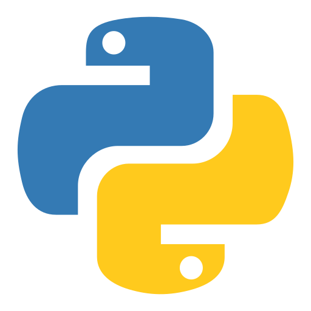
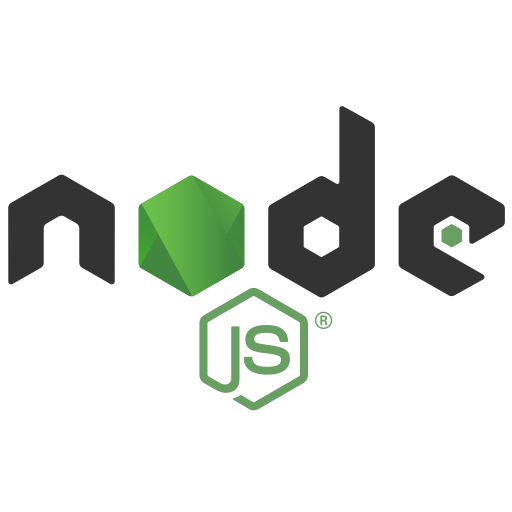
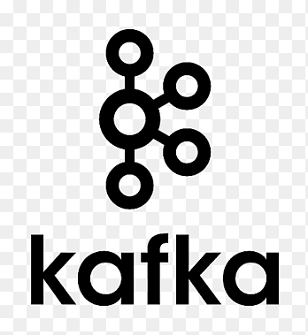

# 👋 Hello, I'm Amod Shanker!

**Backend Engineer · Data & AI**

I build production AI and data systems end to end — most of it running in production in healthcare.

🔗 **[Visit my site → amod981.github.io](https://amod981.github.io/)** — projects and writing on the engineering behind them.

📧 s.amod981@gmail.com

---

### 🛠️ Tools I Use

  
  
  
  
  
  
  

---

### 🎓 Education

<table>
  <tr>
    <td></td>
    <td><strong>MSc in Business Analytics</strong> Imperial College Business School, London, UK</td>
  </tr>
  <tr>
    <td></td>
    <td><strong>Bachelor of Technology in Civil Engineering</strong> Indian Institute of Technology Madras, Chennai, India</td>
  </tr>
</table>

---

### 🏅 Certifications

- **AWS Data Engineer Associate** (August 2024)
- **Advanced SQL** — HackerRank (November 2022)

---

### 📫 Connect with Me

  

